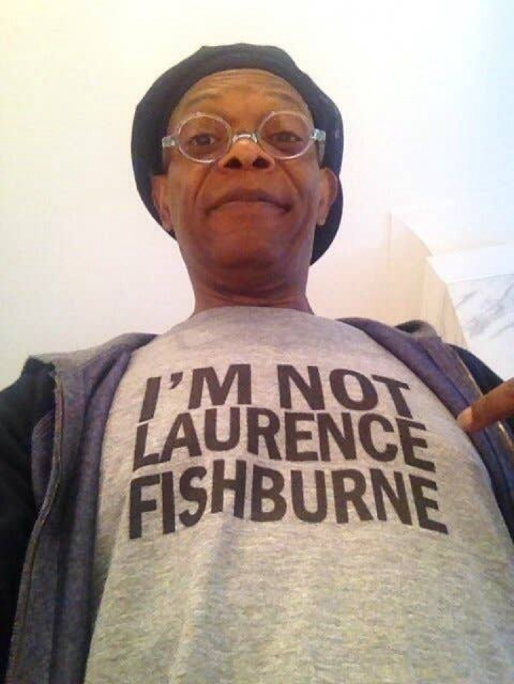

## Building a CNN to classify images of Samuel L Jackson and Laurence Fishburne

### Introduction

After developing deep learning models to predict handwritten digits using the MNIST dataset and then building a model that discerns between cats & dogs I wanted to try my hand at my own image classification project.

Both of these aforementioned projects were great introductions to image classification, and I learned a lot from completing them, however:

1. Neither project was exactly exciting
2. I wasn't invested in them either - I wasn't very interested in whether I could train a computer to discern between 1s and 7s, or tell a Doberman apart from a Sphynx
3. Most importantly, I wanted to see a project through from its inception (data collection, preparation and all) to its end and not just jump straight into building models.

That is when I stumbled across this clip https://www.youtube.com/watch?v=OdxMkQhq58g&t=33s on YouTube where an interviewer mistakes actor Samuel L Jackson for fellow actor Laurence Fishburne. "I'M NOT LAURENCE FISHBURNE" says Samuel L Jackson wagging his finger in frustration at the clearly embarrassed reporter. As I cringed in second-hand embarrassment, it hit me … maybe I could train a neural network to do a better job at discerning between these two actors. And that's exactly what I did.

### Getting the Data 

The first step in any data science project (after clearly defining goals) is to acquire data. Since a ready-made dataset of both actors does not exist, I had to create one. To do this, I needed to build a webscraper. I also needed a website to scrape from. I chose Getty, an online photo-library of millions of images over Google images because Getty has a cool feature that enables users to specify the number of people in an image. Having only one subject in the photo is not a requirement for neural networks to learn, but it does make it easier.

The main libraries I used to webscrape were requests and BeautifulSoup. 

Code for the scraper can be found in the getty_scraper.py file within this repo.

### Data pre-processing and Building the Convolutional Neural Network

The Keras image_data_generator function was used to load and prepare the data to get it into a shape/ format the neural network would accept.

Keras was also used to build, compile and train the model. 

The full code for this can be found in the CNN Classifier jupyter notebook file.

### Results

The final CNN model managed to achieve a test accuracy of 91%.

